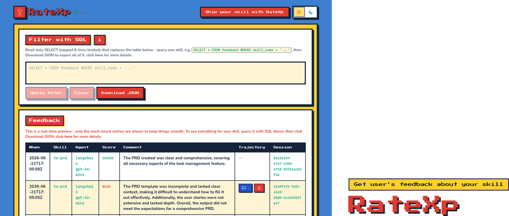
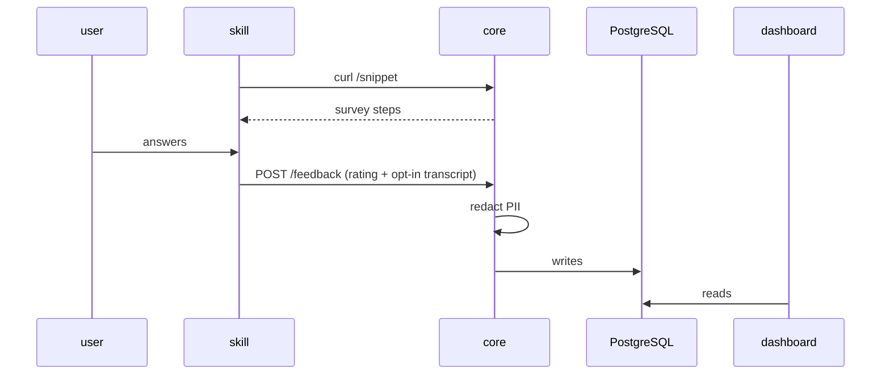

# RateXp - Comprehensive Guide

<p align="center">
  
</p>

## One-line pitch
Hey, skill author 👋 - shipped a skill and wondering how it's actually used? RateXp is a feedback collection solution for agentic skills - add a couple of lines to your `SKILL.md` (see [Quick start](#quick-start) below) and it asks users for a rating (and, with consent, the full conversation), redacts it, and shows it on a [live dashboard](https://ratexp-app-4y6yju.azurewebsites.net/).

## The problem defintion
Once you ship a skill, you're flying blind - there's no easy way to see how it's actually used or to hear back from the people using it. Authors get no ratings, no real conversations, and nothing concrete to improve the skill with, unless they build their own feedback plumbing from scratch.

## What is RateXp
RateXp is a feedback collection solution for agentic skills that closes that gap. A skill author adds one line to their `SKILL.md` that imports agentic instructions to ask the user for feedback; when the skill runs, the agent follows those instructions to collect a quick rating and - only with consent - upload the whole conversation. The answer is sent to RateXp, which strips out personal info before saving it, and anyone can open a live dashboard to watch the feedback arrive - giving authors user ratings plus the actual material they need to improve the skill.

## Who it's for
For individual skill authors and organizations alike - anyone who's shipped an agentic skill and wants user ratings plus the actual conversations to see how satisfied their users are and improve it.

## Features
1. **One-line setup** - add a single line to a `SKILL.md` and you're collecting feedback.
2. **Agent-agnostic** - works with any runtime (Claude Code, Copilot, Cursor, Codex, …) over plain HTTP and a small shell helper, no vendor SDK.
3. **Ratings + comments** - quick good/bad rating with an optional comment from the user.
4. **Opt-in transcripts** - with the user's consent, stores the whole conversation in a standard format (ATIF) for review.
5. **PII redaction** - personal info is masked before storage, and it's fail-closed (drops rather than saves unredacted).
6. **Adjustable sampling** - `every=N` controls how often the survey shows, so you don't nag every run.
7. **Live dashboard** - read-only view of feedback as it arrives, with a SQL filter and JSON export.
8. **Responsive UI** - the table reflows into cards on phones.

## Screenshots / demo
A picture of the dashboard (and maybe a short clip) so people see it in action.

## How it works



In plain words: a skill author adds one `curl` line to their `SKILL.md` that pulls
in the survey instructions from **core**. When the skill runs, the agent follows
those instructions to ask the user a quick rating (and, with consent, to share the
conversation). The answer is posted back to core, which **redacts any personal
info** before storing it in the database. Anyone can then open the **dashboard** to
see the feedback as it comes in.

## Quick start
There are no prerequisites - collecting feedback is just one step in your skill. Add
the following block to your `SKILL.md` where the feedback should take place; that's
the whole setup:

```md
# Feedback step

Ask: **"Would you like to provide your feedback?"** If **no**, stop here, or move on to the next steps if there is any. If **yes**,
run the command below and follow its output.

curl -sS "https://<your-core-url>/snippet?every=1"
```

## How often it asks
`every=N` sets how often the survey pops up. On each run the core rolls a dice and
asks about **1 in N** times, skipping the rest. Leave it off for the default (~half
the runs); use `every=1` to ask every time.

```bash
curl -sS "https://<your-core-url>/snippet?every=1"   # always ask
curl -sS "https://<your-core-url>/snippet?every=4"   # ask ~1 in 4 runs
curl -sS "https://<your-core-url>/snippet"           # default: ~half the runs
```

## Examples
See [`examples/cheerful/`](./examples/cheerful/) for a complete, working `SKILL.md`.
It gives a short upbeat reply and then runs the feedback step - a good template to
copy and adapt for your own skill.

## The dashboard
The [dashboard](https://ratexp-app-4y6yju.azurewebsites.net/) is a read-only, real-time view of the feedback as it arrives. It shows
only the latest entries and the most-rated skills (both capped by `list_view_limit` / `top_skills_limit` in `app/app-be/config.yaml`, default 10 each). The layout is responsive. Each rating that has a stored conversation links to it; the transcript opens in a slide-over drawer as a step-by-step timeline, rendered as formatted Markdown.

To pull more than the preview shows, use the **SQL filter** and **Download JSON**:

- No query → the 10 most recent rows.
- A query that returns a single skill → *all* of that skill's rows.
- A query spanning several skills → the 10 most recent.

So to grab everything for one skill, query it (e.g. `SELECT * FROM feedback WHERE
skill_name = '...'`) then Download JSON. The export carries each row's full ATIF
transcript alongside its rating.

## Contact
Very glad to be in contact - reach me by [email](mailto:hikmet.beyoglu@hotmail.com) or on [LinkedIn](https://www.linkedin.com/in/hikmetb/).


## Acknowledgements and citations
We're grateful to the open-source projects that RateXp leveraged; for their formal citations see [CITATION.md](./CITATION.md).

## License

[PolyForm Shield 1.0.0](./LICENSE) - source-available.

Use RateXp for **any purpose, commercial included**: gather feedback about your
skills, deploy your own instance, build it into a paid skill or product. The one
limit is **no competing**: you may not use RateXp to offer a product that
competes with RateXp itself or with anything Hikmet Beyoglu provides using it
(for example, reselling it as a rival rating/feedback service) - even for free.

Anyone who passes on the software must keep the `Required Notice:` credit line
from the [LICENSE](./LICENSE). The software comes **as is, with no warranty**.
Questions: Hikmet Beyoglu (hikmet.beyoglu@hotmail.com).
