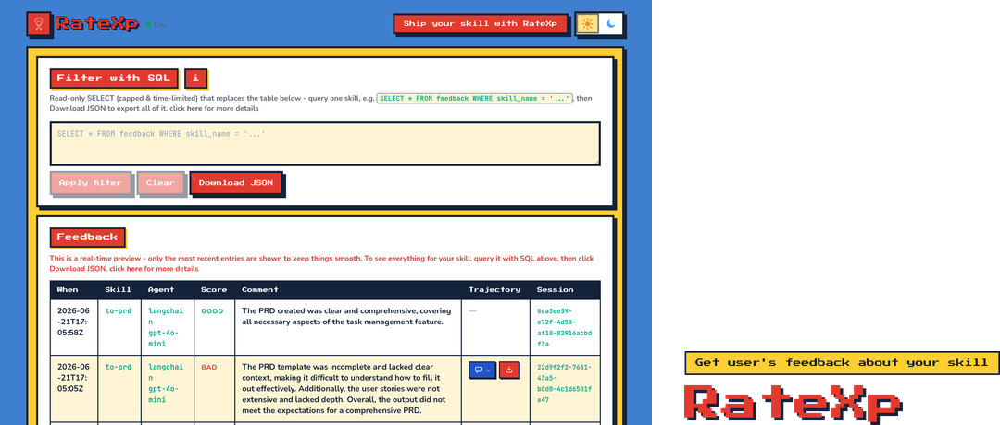
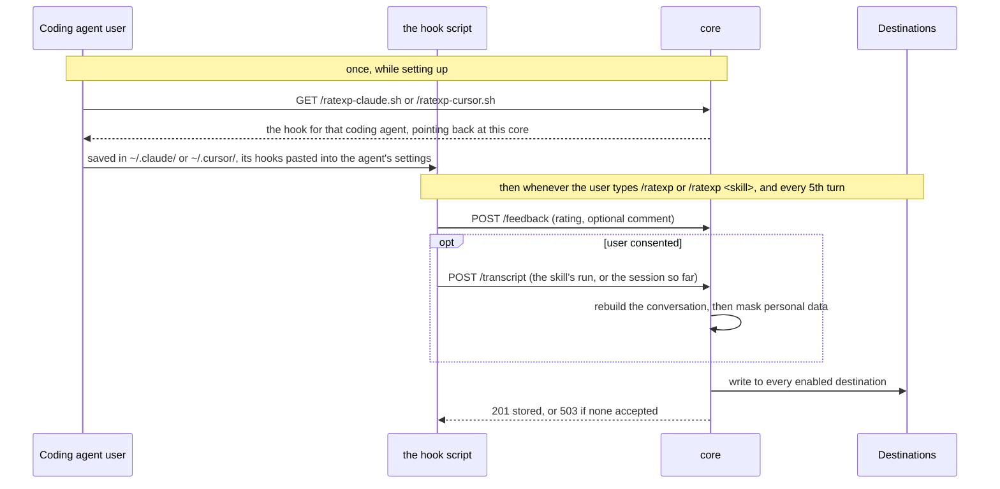
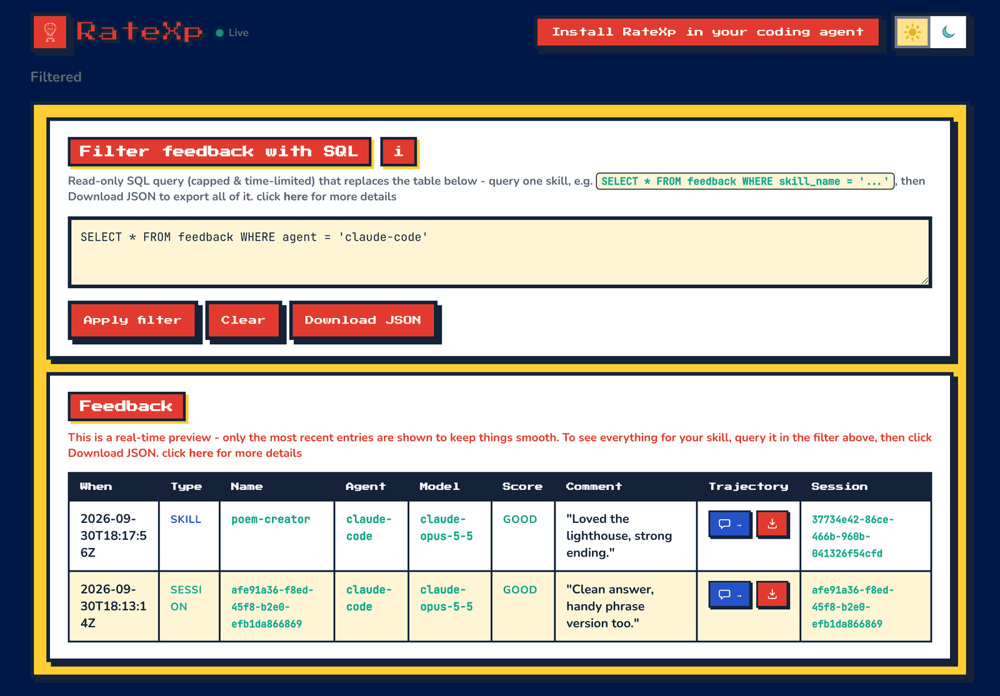

# RateXp
<p align="center">
  
</p>

<p align="center">
  <a href="https://github.com/HikmetB1/RateXp/actions/workflows/ci.yml"></a>
  <a href="https://ratexp-app.azurewebsites.net/"></a>
  <a href="https://ratexp-app.azurewebsites.net/"></a>
  <a href="./LICENSE"></a>
</p>

<p align="center">
  <a href="#intro">Intro</a> ·
  <a href="#quick-start-install-in-one-command">Quick start</a> ·
  <a href="#how-it-works">How it works</a> ·
  <a href="#features-what-you-get">Features</a> ·
  <a href="#the-dashboard-read-and-export-the-feedback">Dashboard</a> ·
  <a href="#contact-how-to-reach-me">Contact</a> ·
  <a href="#acknowledgements-and-citations-projects-ratexp-builds-on">Acknowledgements</a> ·
  <a href="#license-what-you-may-do-with-it">License</a>
</p>

<a id="intro"></a>
**The problem:** coding agents and skills are nowadays measured by benchmarks and tests, but the
person who actually worked with them is rarely asked. Whether the session helped or wasted
their time stays in their head and never reaches the people who could fix it.

**What RateXp does:** it collects **human feedback on the agentic experience, from the human
who had it**. Right inside the coding agent, the user rates the whole session or any skill
they just ran. The rating - and, if they agree, the conversation with anything personal
masked - lands on the [live dashboard](https://ratexp-app.azurewebsites.net/) or your own
storage.

**Who it is for:**
- **Coding agent users** - say what worked and what did not, in seconds, without leaving
  the session -> stay closer to your coding agemt admin/vendor.
- **Skill authors** - see how people rate your skill in real work, not only in your tests.
- **Coding agent providers** - hear from real users on real sessions. See what kinds of
  work your team use the coding agent for, where they get great results and where they
  struggle - then train them where they need it, and tell the vendor what to improve.

**Easy to adopt:** one download and one paste of hooks, once per coding agent - see the
[Quick start](#quick-start-install-in-one-command).

<p align="center">
  
</p>

## Quick start: install in one command

Install RateXp once in the coding agent you use - nothing to configure. As of now it works
with Claude Code and Cursor.

```bash
# Pick one

# Claude Code  ->  saves ~/.claude/ratexp-claude.sh
curl -fsSL https://ratexp-core.azurewebsites.net/ratexp-claude.sh --create-dirs -o ~/.claude/ratexp-claude.sh

# Cursor  ->  saves ~/.cursor/ratexp-cursor.sh
curl -fsSL https://ratexp-core.azurewebsites.net/ratexp-cursor.sh --create-dirs -o ~/.cursor/ratexp-cursor.sh
```

Then paste the hooks from the [dashboard](https://ratexp-app.azurewebsites.net/)'s
**Install RateXp** popup into `~/.claude/settings.json` or `~/.cursor/hooks.json`. That is
the whole setup; ratings land on the same dashboard.

### When it asks: on /ratexp, and every 5th turn

- **The whole session** - whenever you type `/ratexp`, and every 5th turn.
- **How often** - every 5th turn by default; change `DEFAULT_EVERY` at the top of the saved
  script, or set `RATEXP_EVERY`.
- **What is stored** - only with your consent: messages, reasoning, tool calls and their
  results, with personal data masked (redacted) before it is stored.
- **One skill** - type `/ratexp:<skill>` to rate that skill's most recent run.
- **Tested in** - Claude Code and Cursor CLI. 

Want to run your own core instead of the hosted one? See
[CONTRIBUTING.md](./CONTRIBUTING.md#deploy-to-azure-from-zero-to-live).

## How it works

core hands out the hook script, takes back whatever the hook posts, masks anything personal,
and writes the result to every destination switched on - the hook only ever posts to the same
two endpoints and never knows where the data ends up. That is true whether it is rating one
skill or the whole session; only how much of the conversation it covers differs.



## Features: what you get
1. **One install, in your own coding agent** - Claude Code or Cursor, once for every
   project. Nothing has to be built into the skills or the agent you rate.
2. **Rate the session or one skill** - the whole session every 5th turn and on `/ratexp`;
   any skill's most recent run on `/ratexp <skill>` or `/ratexp:<skill>`, the names
   autocompleting in Claude Code.
3. **Ratings and comments** - a quick good/bad rating with an optional comment, asked in one
   go - one picker in Claude Code, two short questions in Cursor - so it never gets in the way.
4. **Opt-in transcripts** - only with the user's consent, that run is stored in a standard
   format (ATIF). The hook uploads it straight from the user's machine.
5. **PII redaction** - personal data is masked before storage by a pluggable adapter
   (self-hosted Presidio or Azure AI Language), and dropped rather than stored unmasked.
6. **Write adapters** - storage is an adapter architecture: core writes each submission to
   every adapter you switch on, and they run independently, so one failing never blocks the
   others. Six ship today - `app_be_psql` (RateXp's PostgreSQL), `custom_psql` (your own
   PostgreSQL), `app_be_dynatrace` (RateXp's Dynatrace), `custom_dynatrace` (your own
   Dynatrace), `bluebox` (a Bluebox workspace) and `phoenix` (an Arize Phoenix project).
7. **Live dashboard** - a read-only view of feedback as it arrives, with a filter box and
   JSON export. Reading is one more adapter, and you enable exactly one of five:
   `app_be_psql` or `custom_psql` (queried with SQL), `app_be_dynatrace` or
   `custom_dynatrace` (queried with DQL), or `phoenix` (queried with `key:value` filters).
   Bluebox is write-only, so it has no read adapter.
8. **Responsive UI** - the table reflows into cards on phones.
9. **Tested models** - Claude Opus (5.5, 5, 4.8, 4.7, 4.6, 4.5), Sonnet (5.5, 5, 4.6, 4.5) and
   Fable.
10. **Tested coding agents** - Claude Code and Cursor CLI

## The dashboard: read and export the feedback
<p align="center">
  
</p>

The [dashboard](https://ratexp-app.azurewebsites.net/) updates as feedback arrives. It shows
the latest ratings and the most-rated skills; a rating with a stored conversation opens it in
a slide-over timeline.

To narrow things down, type an **SQL** query into the filter box.

The box only ever shows the most recent matches. To get more than that, use **Download JSON**.
What it writes depends on what is in the box when you click it:

| In the filter box | What the download contains |
|---|---|
| *(left empty)* | The 10 most recent ratings. |
| `SELECT * FROM feedback WHERE skill_name = 'poem-creator'` | **Every** rating for that skill, up to 1000. |

Every exported row carries its full trajectory beside the rating.

## Contact: how to reach me
Very glad to be in contact - reach me by [email](mailto:hikmet.beyoglu@hotmail.com) or on
[LinkedIn](https://www.linkedin.com/in/hikmetb/).

## Acknowledgements and citations: projects RateXp builds on
We're grateful to the open-source projects that RateXp leveraged; for their licenses and
formal citations see [THIRD_PARTY_NOTICES.md](./THIRD_PARTY_NOTICES.md). To cite RateXp
itself, use [CITATION.cff](./CITATION.cff).

## License: what you may do with it
[PolyForm Shield 1.0.0](./LICENSE) - source-available.

Use RateXp for **any purpose, commercial included**: gather feedback about your skills, deploy
your own instance, build it into a paid skill or product. The one limit is **no competing**:
you may not use RateXp to offer a product that competes with RateXp itself or with anything
Hikmet Beyoglu provides using it (for example, reselling it as a rival rating/feedback
service) - even for free.

Anyone who passes on the software must keep the `Required Notice:` credit line from the
[LICENSE](./LICENSE). The software comes **as is, with no warranty**. Questions:
[email me here](mailto:hikmet.beyoglu@hotmail.com).

---

Want to run it yourself or contribute? See [CONTRIBUTING.md](./CONTRIBUTING.md).
