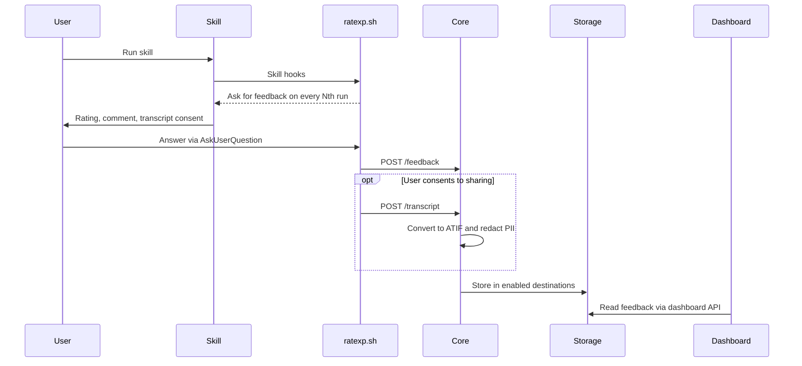

# RateXp

  

  
  
  
  

  <a href="#what-is-ratexp">What it is</a> ·
  <a href="#the-problem-defintion">The problem</a> ·
  <a href="#who-its-for">Who it's for</a> ·
  <a href="#features">Features</a> ·
  <a href="#how-it-works">How it works</a>

  <a href="#quick-start---ship-ratexp-with-your-skill">Quick start</a> ·
  <a href="#how-often-it-asks">How often it asks</a> ·
  <a href="#privacy">Privacy</a> ·
  <a href="#examples">Examples</a> ·
  <a href="#the-dashboard">Dashboard</a> ·
  <a href="#contact">Contact</a> ·
  <a href="#acknowledgements-and-citations">Acknowledgements</a> ·
  <a href="#license">License</a>

## One-line pitch
RateXp collects user ratings and opt-in conversations for Claude Code skills.
Ship `SKILL.md` and `ratexp.sh` with your skill, then view feedback on the
[live dashboard](https://ratexp-app.azurewebsites.net/).

## Demo

  

## The problem defintion
Once you ship a skill, you're flying blind - there's no easy way to see how it's actually used or to hear back from the people using it. Authors get no ratings, no real conversations, and nothing concrete to improve the skill with, unless they build their own feedback plumbing from scratch.

## What is RateXp
RateXp helps skill authors learn from real use. A hook asks users for a good/bad
rating and an optional comment after a skill runs. Users can also share the
conversation; RateXp masks personal information before storing it.

## Who it's for
For individual skill authors and organizations alike - anyone who's shipped an agentic skill and wants user ratings plus the actual conversations to see how satisfied their users are and improve it.

## Features
1. **Two-file setup** - drop `SKILL.md` + `ratexp.sh` into your skill folder. The template includes the hooks that collect feedback.
2. **Tested models** - tested and working with Claude Opus (4.8, 4.7, 4.6, 4.5) and Sonnet (4.6, 4.5).
3. **Ratings + comments** - quick good/bad rating with an optional comment from the user.
4. **Opt-in transcripts** - with the user's consent, stores that run of your skill in a standard format (ATIF) for review. The hook uploads it straight from the user's machine, so it never passes through the model.
5. **PII redaction** - personal info is masked before storage via a pluggable adapter (self-hosted Presidio or Azure AI Language), fail-closed (drops rather than saves unredacted).
6. **Adjustable sampling** - `RATEXP_EVERY` controls how often the survey shows, so you don't nag every run.
7. **Live dashboard** - read-only view of feedback as it arrives, with a filter box (SQL for PostgreSQL, DQL for Dynatrace) and JSON export.
8. **Responsive UI** - the table reflows into cards on phones.
9. **Pluggable destinations** - a submission fans out to any combination of adapters you enable in config: RateXp's PostgreSQL (the live dashboard), your own PostgreSQL, RateXp's Dynatrace, your own Dynatrace, or a Bluebox workspace. Each is independent, and at least one must accept.

## How it works

The hook sends feedback directly from the user's machine. Core stores it, and a
separate read-only dashboard API reads the selected data source and streams updates
to the UI.

### Where your data goes
core validates and redacts each submission once, then writes it to **every
destination you enable** in `core/config.yaml` (the `write_adapters` block) -
PostgreSQL, Dynatrace or [Bluebox](https://bluebox.ai), RateXp's own or your own:

| | PostgreSQL | Dynatrace (OpenTelemetry) | Bluebox (OpenTelemetry) |
|--|--|--|--|
| **RateXp's** | `app_be_psql` - RateXp's DB, the live dashboard reads it | `app_be_dynatrace` - RateXp's Dynatrace tenant | — |
| **Your own** | `custom_psql` - your database (`CUSTOM_PSQL_DSN`) | `custom_dynatrace` - your tenant (`CUSTOM_DT_TOKEN`) | `bluebox` - your workspace (`BLUEBOX_OTLP_ENDPOINT`, `BLUEBOX_OTLP_TOKEN`) |

Enable any combination - the adapters are **independent**, so one failing (or a
Dynatrace token being absent) is logged and never blocks the others. A submission
is **accepted once at least one destination takes it**; if none do, core answers
`503` and the hook tells the user it could not be sent. Secrets (DB strings, tokens)
come from env vars named in the config, never from the file itself. See
[`core/modules/write/adapters/`](./core/modules/write/adapters/) and
[`core/modules/write/dispatch_to_adapters.py`](./core/modules/write/dispatch_to_adapters.py).

The read side is a single source you pick: the live dashboard reads from **one** read
adapter ([`app/app-be/read_adapters/`](./app/app-be/read_adapters/)) - **PostgreSQL**
(queried with SQL) or **Dynatrace** (the fanned-out logs, queried with DQL). The
dashboard's **filter box speaks that source's own language** - SQL when reading
PostgreSQL, DQL when reading Dynatrace - so the box works either way. So writes fan
out to many destinations; reads come from one source you pick.

**Bluebox is write-only**, so it's the one destination with no read adapter: it
deliberately exposes no query language, and you read it back by asking in plain
English (`bluebox ask "which skills got the most bad ratings this week"`) rather
than through the dashboard.

## Quick start - ship RateXp with your skill
Requires Claude Code, Bash 3.2+, and curl.

1. Copy the two files in [`core/template/skill/`](./core/template/skill/) - `SKILL.md`
   and `ratexp.sh` - into `.claude/skills/<your-skill-name>/`.
2. Replace every `<your-skill-name>` in `SKILL.md` with your skill's folder name,
   then write your skill instructions in the body. Keep the hook frontmatter.
3. Run your skill and view submitted ratings on the
   [dashboard](https://ratexp-app.azurewebsites.net/).

For an existing skill, copy `ratexp.sh` and merge the template's `hooks` into its
frontmatter. Include `AskUserQuestion` if you use an `allowed-tools` list.
For a plugin, use [`core/template/plugin/`](./core/template/plugin/).

A self-hosted core serves a configured script at `GET /ratexp.sh`.
See [CONTRIBUTING.md](./CONTRIBUTING.md) for local development and deployment.

## How often it asks
The hook asks on every Nth run of each skill within a session. The shipped default
is **2**, set by `default_survey_every` in [`core/config.yaml`](./core/config.yaml).
Set `RATEXP_EVERY=1` to ask every run, or choose a larger number to ask less often.
`RATEXP_URL` overrides the destination.

## Privacy
Submitted feedback includes the skill name, rating, optional comment, agent name,
session ID, and request ID. Transcript sharing requires **“Yes, store trajectory”**
in the survey; **“No, do not store”** keeps it private.

When the hook observes the skill starting, it uploads the conversation from that
point through the survey response. If the initial start event is unavailable, the
upload includes the session so far. Core masks personal information before storage
and drops the transcript if redaction fails.

## Examples
The same poem-writing skill, packaged both ways, with the feedback hooks already
wired up - ask for a mood, get a short original poem:

- [`core/examples/example_skill_poem_creator/`](./core/examples/example_skill_poem_creator/) -
  a plain skill: `SKILL.md` plus its `ratexp.sh`.
- [`core/examples/example_plugin_poem_creator/`](./core/examples/example_plugin_poem_creator/) -
  the same skill as a plugin, hooks resolved from `${CLAUDE_PLUGIN_ROOT}`.

For a blank starting point, copy [`core/template/`](./core/template/).

## The dashboard
The [dashboard](https://ratexp-app.azurewebsites.net/) is a read-only, real-time view of the feedback as it arrives. It shows
only the latest entries and the most-rated skills (both capped by `list_view_limit` / `top_skills_limit` in `app/app-be/config.yaml`, default 10 each). The layout is responsive. Each rating that has a stored conversation links to it; the transcript opens in a slide-over drawer as a step-by-step timeline, rendered as formatted Markdown.

To pull more than the preview shows, use the **filter box** - it speaks the read
source's own language (SQL for PostgreSQL, DQL for Dynatrace) - and **Download JSON**:

- No query → the 10 most recent rows.
- A query that returns a single skill → *all* of that skill's rows.
- A query spanning several skills → the 10 most recent.

So to grab everything for one skill, query it (e.g. `SELECT * FROM feedback WHERE
skill_name = '...'`) then Download JSON. The export carries each row's full ATIF
transcript alongside its rating.

## Contact
Very glad to be in contact - reach me by [email](mailto:hikmet.beyoglu@hotmail.com) or on [LinkedIn](https://www.linkedin.com/in/hikmetb/).

## Acknowledgements and citations
We're grateful to the open-source projects that RateXp leveraged; for their licenses and formal citations see [THIRD_PARTY_NOTICES.md](./THIRD_PARTY_NOTICES.md).

## License

[PolyForm Shield 1.0.0](./LICENSE) - source-available.

Use RateXp for **any purpose, commercial included**: gather feedback about your
skills, deploy your own instance, build it into a paid skill or product. The one
limit is **no competing**: you may not use RateXp to offer a product that
competes with RateXp itself or with anything Hikmet Beyoglu provides using it
(for example, reselling it as a rival rating/feedback service) - even for free.

Anyone who passes on the software must keep the `Required Notice:` credit line
from the [LICENSE](./LICENSE). The software comes **as is, with no warranty**.
Questions: Hikmet Beyoglu (hikmet.beyoglu@hotmail.com).
