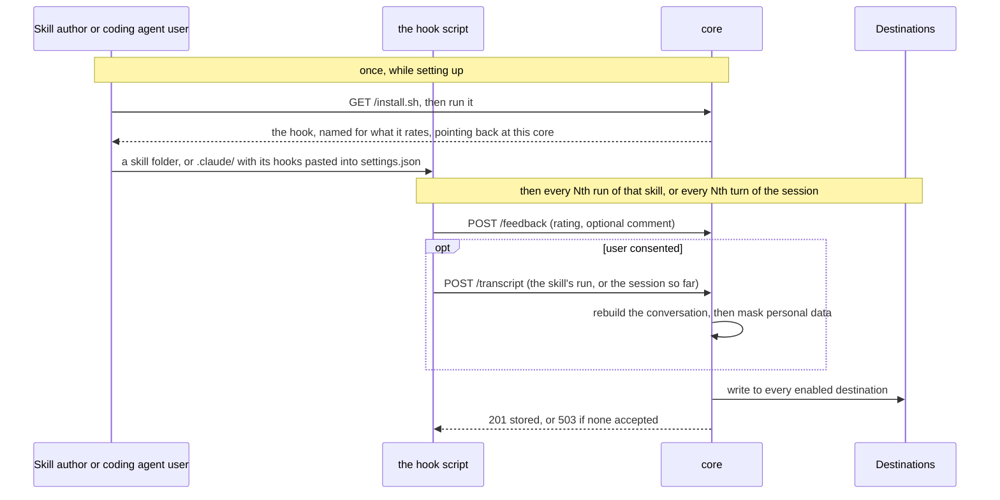

# RateXp
<p align="center">
  
</p>

<p align="center">
  <a href="https://github.com/HikmetB1/RateXp/actions/workflows/ci.yml"></a>
  <a href="https://ratexp-app.azurewebsites.net/"></a>
  <a href="https://ratexp-app.azurewebsites.net/"></a>
  <a href="./LICENSE"></a>
</p>

<p align="center">
  <a href="#quick-start-install-in-one-command">Quick start</a> ·
  <a href="#how-it-works">How it works</a> ·
  <a href="#examples-a-skill-you-can-copy">Examples</a> ·
  <a href="#features-what-you-get">Features</a> ·
  <a href="#the-dashboard-read-and-export-the-feedback">Dashboard</a> ·
  <a href="#contact-how-to-reach-me">Contact</a> ·
  <a href="#acknowledgements-and-citations-projects-ratexp-builds-on">Acknowledgements</a> ·
  <a href="#license-what-you-may-do-with-it">License</a>
</p>

Dear skill author and coding-agent admin, who would like to stay close to your users - and
dear user, who would like to stay close to whoever built the skill or coding agent you use:

RateXp rates the **agentic experience, by the human who had it** - asked immediately in the
terminal where the work happened, not somewhere afterwards. The person using your skill or
coding agent is the one who rates it: a skill on its own runs, a coding agent session by
session. The feedback lands on the
[live dashboard](https://ratexp-app.azurewebsites.net/) or your own storage adapter.

<p align="center">
  
</p>

## Quick start: install in one command

Pick the command that satisfies your use case, nothing to configure. Needs Claude Code, Bash 3.2+ and curl - run it
from your project root:

```bash
# Pick one

# Use case: A skill Author would like to stay close to the skill users and get their feedback
# A skill  ->  creates .claude/skills/my-skill/ -> Update your SKILL.md in your skill folder as usual
curl -fsSL https://ratexp-core.azurewebsites.net/install.sh | bash -s skill my-skill

# Use case: A coding agent provider or access admin would like to stay close to the coding agent users and get their feedback
# The coding agent itself  ->  creates .claude/ratexp-coding-agent.sh -> then paste the hooks it prints into .claude/settings.json
curl -fsSL https://ratexp-core.azurewebsites.net/install.sh | bash -s session claude
```

That is the whole setup. Ratings land on the
[dashboard](https://ratexp-app.azurewebsites.net/).

### How often it asks: every 2nd run or turn

- **Skill** - every 2nd **run** of that skill, so it never nags.
- **Coding agent** - every 2nd **turn** of the session, and `/ratexp` asks on the spot.

Change `DEFAULT_EVERY` at the top of the hook script the install put in place -
`ratexp-skill.sh` or `ratexp-coding-agent.sh` - to change the default for everyone you
ship it to.

Want to run your own core instead of the hosted one? See
[CONTRIBUTING.md](./CONTRIBUTING.md#deploy-to-azure-from-zero-to-live).

## How it works

core hands out the hook script, takes back whatever the hook posts, masks anything personal,
and writes the result to every destination switched on - the hook only ever posts to the same
two endpoints and never knows where the data ends up. That is true whether it is rating one
skill or a whole coding-agent session; only what arms it, and how much of the conversation it
covers, differ.



## Examples: a skill you can copy
A poem-writing skill with the hooks already wired - ask for a mood, get a short original poem:

- [`core/examples/example_skill_poem_creator/`](./core/examples/example_skill_poem_creator/) -
  `SKILL.md` plus its `ratexp-skill.sh`.

For a blank starting point, copy [`core/template/`](./core/template/).

## Features: what you get
1. **Skill author: ship it inside your skill** - drop `SKILL.md` +
   `ratexp-skill.sh` into the skill folder and publish as usual. Everyone who installs your
   skill gets the hooks with it, and each rating comes back named after that skill.
2. **Coding agent admin: hand it to your users** - give them `ratexp-coding-agent.sh` and
   the hooks to paste into `settings.json`. Rating is then on from their first turn, and each rating covers the whole session.
3. **Ratings and comments** - a quick good/bad rating with an optional comment, and never
   more than one question, so it never gets in the way.
4. **Opt-in transcripts** - only with the user's consent, that run is stored in a standard
   format (ATIF). The hook uploads it straight from the user's machine.
5. **PII redaction** - personal data is masked before storage by a pluggable adapter
   (self-hosted Presidio or Azure AI Language), and dropped rather than stored unmasked.
6. **Write adapters** - storage is an adapter architecture: core writes each submission to
   every adapter you switch on, and they run independently, so one failing never blocks the
   others. Six ship today - `app_be_psql` (RateXp's PostgreSQL), `custom_psql` (your own
   PostgreSQL), `app_be_dynatrace` (RateXp's Dynatrace), `custom_dynatrace` (your own
   Dynatrace), `bluebox` (a Bluebox workspace) and `phoenix` (an Arize Phoenix project).
7. **Live dashboard** - a read-only view of feedback as it arrives, with a filter box and
   JSON export. Reading is one more adapter, and you enable exactly one of five:
   `app_be_psql` or `custom_psql` (queried with SQL), `app_be_dynatrace` or
   `custom_dynatrace` (queried with DQL), or `phoenix` (queried with `key:value` filters).
   Bluebox is write-only, so it has no read adapter.
8. **Responsive UI** - the table reflows into cards on phones.
9. **Tested models** - works with Claude Opus (5, 4.8, 4.7, 4.6, 4.5) and Sonnet (5, 4.6, 4.5).
10. **Tested coding agents** - Claude CLI

## The dashboard: read and export the feedback
<p align="center">
  
</p>

The [dashboard](https://ratexp-app.azurewebsites.net/) updates as feedback arrives. It shows
the latest ratings and the most-rated skills; a rating with a stored conversation opens it in
a slide-over timeline.

To narrow things down, type an **SQL** query into the filter box.

The box only ever shows the most recent matches. To get more than that, use **Download JSON**.
What it writes depends on what is in the box when you click it:

| In the filter box | What the download contains |
|---|---|
| *(left empty)* | The 10 most recent ratings. |
| `SELECT * FROM feedback WHERE skill_name = 'poem-creator'` | **Every** rating for that skill, up to 1000. |

Every exported row carries its full trajectory beside the rating.

## Contact: how to reach me
Very glad to be in contact - reach me by [email](mailto:hikmet.beyoglu@hotmail.com) or on
[LinkedIn](https://www.linkedin.com/in/hikmetb/).

## Acknowledgements and citations: projects RateXp builds on
We're grateful to the open-source projects that RateXp leveraged; for their licenses and
formal citations see [THIRD_PARTY_NOTICES.md](./THIRD_PARTY_NOTICES.md). To cite RateXp
itself, use [CITATION.cff](./CITATION.cff).

## License: what you may do with it
[PolyForm Shield 1.0.0](./LICENSE) - source-available.

Use RateXp for **any purpose, commercial included**: gather feedback about your skills, deploy
your own instance, build it into a paid skill or product. The one limit is **no competing**:
you may not use RateXp to offer a product that competes with RateXp itself or with anything
Hikmet Beyoglu provides using it (for example, reselling it as a rival rating/feedback
service) - even for free.

Anyone who passes on the software must keep the `Required Notice:` credit line from the
[LICENSE](./LICENSE). The software comes **as is, with no warranty**. Questions:
[email me here](mailto:hikmet.beyoglu@hotmail.com).

---

Want to run it yourself or contribute? See [CONTRIBUTING.md](./CONTRIBUTING.md).
