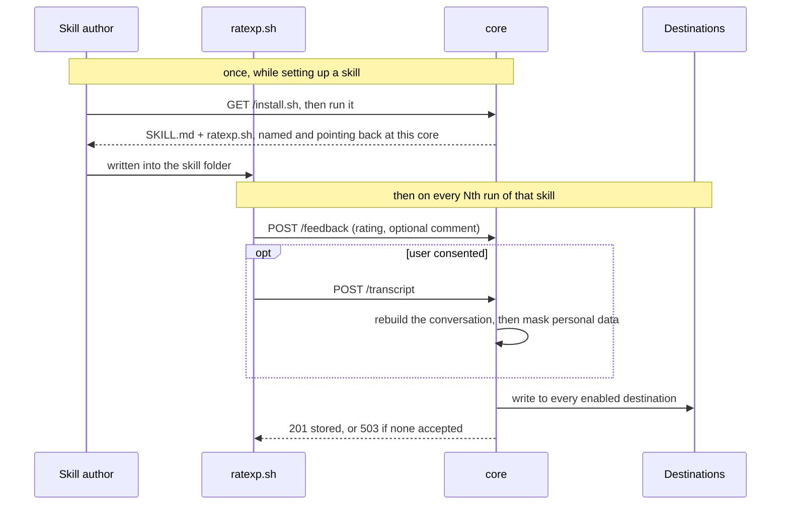

# core

## Installing into a skill/plugin

README TODO: tto be duplicated on the main readme 

```bash
curl -fsSL <core>/install.sh | bash -s skill my-skill     # .claude/skills/my-skill/
curl -fsSL <core>/install.sh | bash -s plugin my-plugin   # my-plugin/skills/my-plugin/
```

Either one leaves you a `SKILL.md` and a `ratexp.sh`. Write your skill in the body of
`SKILL.md` and leave the frontmatter alone - that is what runs the hook.

`ratexp.sh` needs no editing - the core that served it already filled in where to post and
how often to ask. Set `RATEXP_EVERY` to ask more or less often for a run:

```bash
RATEXP_EVERY=1 claude
```

## What it solves
README TODO: the problem the soluton slves is to be written on the main read me and only a tiny scentese on regarding the mermaid charto to be added instead. 

A skill author has no way of knowing whether their skill actually helped anyone. RateXp asks
the user for a quick rating at the end of a run; core is the half that serves and stores.

It hands out the hook script, takes back whatever the hook posts, masks anything personal,
and writes the result to every destination you switched on. `ratexp.sh` itself always posts
to the same two endpoints and never knows where the data ends up: core is the admin.



## Config

Everything tunable lives in [`config.yaml`](./config.yaml), which explains each key inline:

- `schema_version`: ATIF version stamped on every stored transcript
- `max_body_bytes` / `max_transcript_bytes`: largest request accepted, and largest trajectory
  stored in full (anything bigger keeps a meta-only stub)
- `rate_limit_per_minute`: per-IP budget; `0` turns the limiter off
- `default_survey_every`: ask on every Nth run, baked into the hook copies
- `redaction`: whether personal data is masked, and which adapter does it
- `write_adapters`: which destinations every submission is written to

## Hook copies

`GET /ratexp.sh` fills in the blanks in `ratexp.sh` per request. The copies under `template/`
and `examples/` are generated from it, so edits to a copy get wiped. Change `ratexp.sh`, then
regenerate:

```bash
python3 tools/sync_hooks.py          # regenerate the copies
python3 tools/sync_hooks.py --check  # report drift, change nothing (the tests run this)
```

A new template or example needs a line in `tools/sync_hooks.py`, or its copy keeps the blanks.
